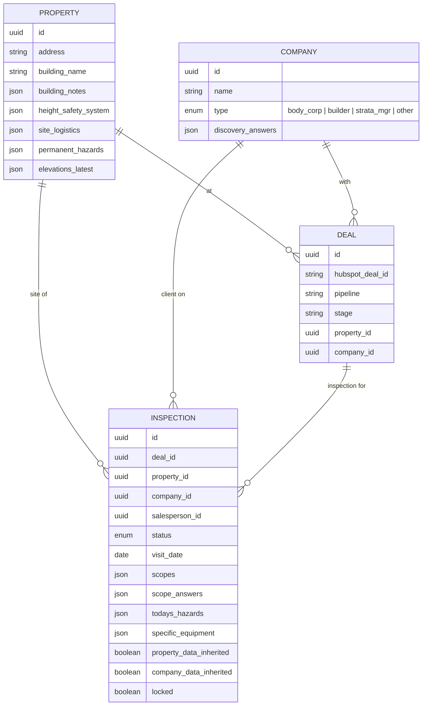

# RAT Site Visit App — Project Brief v4 (Final)

**Owner:** Chay Taccori, Rope Access Technicians Pty Ltd
**Target:** Extension of existing `apps.ropeaccess.com.au` platform (Next.js 15 + Supabase + Vercel)
**Status:** Scoping complete — ready for developer handoff

---

## 1. Purpose

Replace the current AppSheet-based site inspection tool with a purpose-built module in `apps.ropeaccess.com.au`. Lets a salesperson walk a site with a client, capture everything needed to quote the job, and push cleanly into HubSpot, simPRO, Google Drive, and the quoting tool — **without the sales conversation being interrupted by manual data entry**.

## 2. Core Principle

**Start Meeting → salesperson walks and talks naturally → app captures ambient audio in the background purely as a note-taking aid → at End Meeting the audio is transcribed and used to pre-fill the form, then discarded → salesperson reviews/corrects → inspection completes and pushes to HubSpot, simPRO, Google Drive, and the quoting tool.**

Audio is a means to fill the form. It is not a record.

## 3. Architecture Context (existing)

- **Platform:** `apps.ropeaccess.com.au` — Next.js 15, Supabase, Vercel.
- **Auth:** PIN login. Homepage → pick name → PIN.
- **Existing role system:** Team Member admin page already manages users and permissions. **Site Visit module plugs into this** — no new permissions UI.
- **Live modules:** Dashboard, Jobs (Simpro), Drop Tracker, Simple Repair Tracker, Toolbox Talk, Purchase Receipts (JGID + AI), Leave Request, **Sales Pipeline (HubSpot-powered — Site Visit module reuses its deal-picker component)**, SDS/TDS Library, Timesheets (Simpro), Login/Auth.
- **Site Visit module:** placeholder route only, greenfield build.
- **Connected APIs:** Simpro, HubSpot, JGID (one-way out), Google Drive.

## 4. Data Model (Four Layers)

The data splits into four entities with independent lifecycles. This separation is the key architectural decision and drives how returning-site inheritance works.

### How each layer works

**Property** — the physical building. Lives independently of who the client is. Stores the latest known state of:
- Elevations (photos/videos/comments per compass point + custom)
- Building Notes (stairs, elevator, egress, height, etc.)
- Height Safety System (components, certification status, anchor plan, manual)
- Site Logistics (grounds, parking, storage, rooftop access, toilets)
- Permanent hazards (power lines, RF towers — things that aren't going anywhere)

**Company** — the client you're actually talking to. Stores:
- Discovery answers (hopes & dreams, contractor preferences, success criteria)
- Company type (body corp / builder / strata manager / other) — so the right discovery questions show

**Deal** — a specific HubSpot opportunity. Links a property + a company + a piece of work.

**Inspection** — this specific site visit. Scope being quoted, scope answers, today's hazards (plant/equipment on site right now vs permanent property hazards), specific equipment. Also records whether property/company data was inherited at creation.

### Inheritance on inspection start

When a salesperson starts an inspection:
1. App checks if the selected HubSpot deal's address matches a known Property → offer "Use existing property data?"
2. App checks if the deal's company matches a known Company → offer "Use existing client discovery?"
3. Two independent yes/no answers:
   - **Same building, same client** → both yes (most common on recurring work).
   - **Same building, new client** (builder on a body corp property) → property yes, company no.
   - **Same client, new building** (body corp with multiple properties) → company yes, property no.
   - **Fresh** → both no.
4. Inherited data is **editable** during the visit. Updates roll back to the Property/Company records on inspection completion, keeping the "latest known state" fresh.

## 5. Functional Requirements

### 5.1 Voice-Assisted Form Fill
- **Start Meeting** → ambient audio capture (screen can lock, phone in pocket). Recording indicator visible.
- **End Meeting** → audio transcribed, Claude extracts structured data into form fields.
- Salesperson reviews / corrects populated fields.
- **Audio file deleted immediately after transcription.** Transcript deleted on inspection finalisation. Only confirmed form data persists.
- **Offline:** audio stored locally until signal returns, then transcribed.
- **v1 mode:** end-of-visit batch extraction. Architected so "periodic catch-up" (every 30–60s) is a config flag, not a rewrite.

### 5.2 Inspection Status Workflow
`Enquiry` → `Site Visit Scheduled` → `Site Visit In Progress` → `Inspection Complete — Ready to Quote` → `Quoted` → `Won` / `Lost`

Status transitions push HubSpot deal stage updates.

### 5.3 Site Info (Inspection-level)
- Site Name, Site Address (defaults from Property)
- Site Contact, Phone, Email (defaults from HubSpot deal)
- **CTS/SP #** — manual entry, reference for body corp / owners corp
- Quoted Scope (auto-linked to Services/Scopes selection)
- **Site Classification: Simple / Complex** — sales sets; flag for Ops Manager re: Level 2/3 abseiler resourcing (straight drops vs aid routes / re-anchors)
- Enquiry Date, Site Visit Date, Proposal Due Date
- Date Decision Will Be Made, Expected Project Start Date
- What was your reason for contacting us?
- How did you hear about us?

### 5.4 Client Discovery (Company-level, voice-extractable)
- What is important to you when hiring a contractor?
- Who is the best contractor you have worked with and why?
- What does a successful job look like?
- What rope access contractors have you worked with recently?
- What could have been done better?

*Questions may vary slightly by company type (body corp vs builder) in a future phase — v1 uses the same set for all.*

### 5.5 Services & Scopes (Inspection-level, multi-select)

1. **Window Cleaning** — Inaccessible Windows (freq, curved glass), External Balustrades (budget, feet/knuckles), Internal Balustrades, Balcony Windows & Doors, High Common Area Glass, Low Common Area Glass, Reception Area Glass, Glass Awnings (Top Side), Glass Awnings (Underside), Town Houses.
2. **Pressure Cleaning** — Inaccessible Facade (freq, budget), Balconies, Rooftop, Ground Floor, Perimeter Walls, Car Park.
3. **Joint Sealing** — Expansion Joints (measurements/drawing), Window Perimeter Seals (preferred product), Flashings (paint after?), Wet Sealing Glass (avg width), Apolic Cladding Re-seals, Balcony Perimeter Joints, Other.
4. **Painting** — Lift Motor Room (paint spec), Rooftop (budget), Whole Facade (facade inspection done?), Ground Floor Walls (repair approach?), Handrails, Window Frames, Awning.
5. **Facade Inspection** — Whole Facade (what specifically wanted found?), Specific Areas.
6. **Glass Replacement** — How many panels? Daylight measurements per panel.
7. **Concrete Repairs** — How many locations identified? Facade inspection done?
8. **Height Safety System Install** — Locations, what areas need access, roof structure (Steel/Concrete), design in mind, budget in mind.

### 5.6 Building Notes (Property-level)
Job-duration drivers. Inherited on returning visits, editable:
- Can every drop be safely egressed to a common area?
- Is there an elevator?
- How many flights of stairs to get to the roof?
- Do we need to abseil over a gutter?
- Is there a lot of walk between drops?
- Are there multiple rigging levels?
- Is the building like a maze?
- Does the Height Safety System seem sufficient?
- How tall is the building?
- Is ground floor G or 1?
- Are there any skipped levels?

### 5.7 Height Safety System (Property-level)

**Component checklist** — each: checkbox + comment + multi-photo/video:
Concrete Anchors, Surface Mount Anchor Points, Static Lines, Fixed Ladders, Fold Down Ladder, Ladder Brackets, Needles, Davit Arms, Rails, Roof Hatch, System ID plate, System Tagged.

**Questions & documents:**
- When was it last certified?
- Anchor plan (file upload)
- O&E / user manual (file upload)
- Compliance plate (photo)

### 5.8 Hazards (Inspection-level with Property-level override)
Visible prompt list, collapsible. Each: checkbox + comment + multi-photo/video. **Add Custom Hazard** button.

Fixed hazards: Power Lines, Sharp Flashing, Exposed Roof Edge, Plant/Equipment, Public Thoroughfare, Abseil Over Balustrade, RF Towers, Unsafe Height Safety System.

Each custom hazard can be flagged **"permanent property hazard"** → promoted to Property-level on inspection complete, auto-appears on future inspections at the same site.

### 5.9 Elevations (Property-level, photos/videos editable per inspection)
8 fixed compass points + **Add Custom Elevation** button. Each: multi-photo/video + comment.
N, NE, E, SE, S, SW, W, NW.

### 5.10 Site Logistics (Property-level)
Multi-photo/video + comment each: Grounds, Parking, Storage Area, Rooftop Access, Toilet Locations.

### 5.11 Specific Equipment (Inspection-level)
Equipment required/observed with photos and notes.

### 5.12 Media Constraints
- **Video cap:** 5 minutes per clip.
- **"Include in proposal" toggle per photo** — exported as a separate bundle for the estimator to drop into the quote (avoids scope ambiguity).

## 6. Completion, Locking & Edit Audit

- **Only the Sales role can mark an inspection complete.** Admin/Estimator/Ops Manager have read-only access for oversight.
- On complete: inspection is **locked (read-only)**.
- **Unlock flow:** edit permission → "Are you sure?" prompt → inspection unlocks for that user.
- **Full-transparency audit log:** every post-completion edit logged (who, when, field, before/after). Visible to **all roles** — the original salesperson sees their own history, Admin/Ops Manager see everyone's.

## 7. User Roles & Permissions

Managed via the existing Team Member admin page. Site Visit adds these permission types:

| Role | Site Visit permissions |
|---|---|
| **Admin** | Full CRUD, override lock, view all audit logs |
| **Sales** | Create/edit own inspections, mark complete, edit post-completion (audited) |
| **Estimator** | Read assigned inspections, receive "Ready to Quote" handoff, add comments |
| **Operations Manager** | Read all, add comments, view audit logs |
| **"Can Quote" flag** | Orthogonal to role. User appears in the "assign estimator" dropdown on Ready to Quote. Currently Peter Knapp (Estimator) and Liam Croasdale (Ops Manager / GM backup). |

## 8. Integrations

### 8.1 HubSpot (two-way)
- **Pipelines & stages pulled live from HubSpot API** — dropdowns update automatically when HubSpot config changes.
- **Deal picker reuses the existing Sales Pipeline module's component** for UX consistency and code reuse.
- **90% path:** salesperson picks an existing HubSpot deal. Contact, address, deal properties pre-fill.
- **10% path (door-to-door):** salesperson starts fresh. On inspection completion, a HubSpot deal is auto-created and linked.
- **Stage movement:** inspection status → deal stage.
- **Notes:** summary note on deal at each status transition.
- **Task + email:** on "Ready to Quote", assign "Quote this job" HubSpot task to selected quoter + email them.

### 8.2 simPRO
- On "Ready to Quote" → **create draft quote in simPRO** pre-populated with scope/details.
- simPRO quote ID links back to the inspection.
- (Longer-term: custom simPRO quoting UI — out of scope for this project.)

### 8.3 JGID
- No action from Site Visit module. Existing one-way-out flow untouched.

### 8.4 Quoting Tool (Sammy)
- No API available → inspection generates **PDF report + photo bundle + scope summary** as a single "Download for Sammy" export on completion.
- Swap for webhook push when Sammy ships API.

### 8.5 Google Drive
- Auto-generated inspection PDF → deal-specific folder (matches Simple Repair Tracker pattern).
- Shareable link attached to the HubSpot deal note.

## 9. Privacy & Consent

Audio is **never retained** — transcribed once, form fields populated, audio deleted. Mechanically equivalent to the salesperson taking notes.

**No recording-consent prompt required.** Standard professional conduct ("I'll be taking notes through my tablet") is sufficient. Not legal advice — worth a 10-minute review with your lawyer before launch given QLD/NSW variation.

## 10. Media Storage

**Hybrid, mirroring Simple Repair Tracker:**
1. Hot media (active inspection, being quoted) → Supabase Storage.
2. Cold media (inspection won/lost/archived) → Google Drive, deal-specific folder.
3. Future swap at ~500GB hot storage: Cloudflare R2 for video, Supabase retained for photos.

Year 1 cost under $20/month.

## 11. Non-Functional Requirements

- Mobile-first, one-handed phone use.
- Offline-capable — queue uploads, voice recording works offline.
- Background uploads, resumable for video.
- PWA installable.
- Auto-save every field change.

## 12. Notifications

- **On "Ready to Quote":** assigned quoter receives email + HubSpot task.
- Future: in-app notifications, Slack.

## 13. Edge Cases

- **Multi-day visits:** supported. Status stays `Site Visit In Progress` across days until sales marks complete.
- **Handoff between salespeople:** supported. Any salesperson can pick up an in-progress inspection if reassigned by Admin.
- **Returning sites / scope expansion:** handled via four-layer data model inheritance (section 4).

## 14. Phasing

**Phase 1 — MVP (replaces AppSheet):**
- Four-layer data model
- All form sections, manual entry
- Fast photo/video upload, offline, background sync
- Role-based access via existing Team Member admin
- HubSpot pipeline/stage pickers (API-driven), deal linking, auto-create on completion
- simPRO draft quote creation on Ready to Quote
- Auto-generated PDF report → Google Drive + HubSpot note
- Quoter email + HubSpot task on Ready to Quote
- Completion lock + full-transparency edit audit
- Property/Company inheritance on returning visits

**Phase 2 — Voice-assisted form fill:**
- Ambient audio → transcription → field extraction → audio deletion
- Review/correct flow
- Offline-safe capture

**Phase 3 — Quoting loop upgrade:**
- Sammy API (when available)
- Two-way HubSpot webhook refinements
- Company-type-specific discovery question sets

**Phase 4 — Polish:**
- Real-time transcription
- Analytics (cycle time, conversion, hazard patterns)
- Slack / in-app notifications

## 15. Assumptions for Developer Kickoff

These are my best calls based on everything discussed — developer should flag any concerns during kickoff:

1. **PDF report template** — I'll draft a branded template matching existing RAT document style (the facade report / service agreement aesthetic). Needs a ~2-hour review session once drafted.
2. **Property matching on returning visits** — use address match (normalised) with salesperson confirmation. "Is this the same building as [X]?" dialog.
3. **Company matching** — use the HubSpot deal's associated Company record as source of truth.
4. **Permanent vs today's hazards** — default all hazards to inspection-level. Custom hazards flagged "permanent property hazard" promote to Property-level on completion.
5. **"Can Quote" flag** — new user permission added to Team Member admin page. Admin toggles per user.
6. **Audit log retention** — keep indefinitely. Storage cost negligible for text-only log entries.
7. **simPRO draft quote format** — use simPRO's native "Quote" entity with scope line items matching RAT's standard quote structure. Final formatting still happens in simPRO.

---

**This brief is ready to hand to a developer.** All architectural decisions are made. Phasing is clear. Open items are assumptions the developer can confirm during kickoff rather than blockers.
